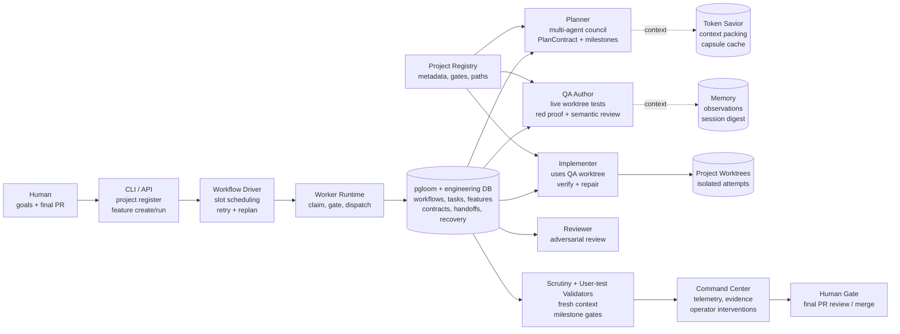
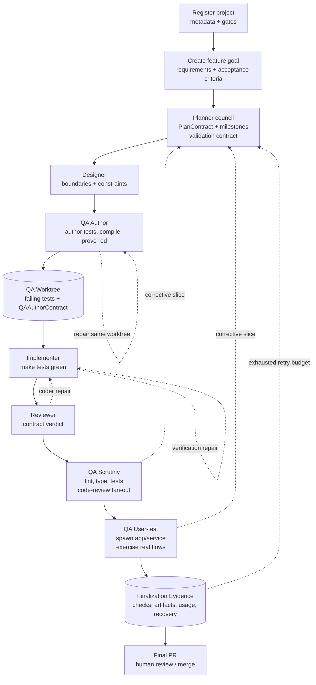

# pgloom-engineering

`pgloom-engineering` is the engineering-focused orchestrator built on top of
`pgloom`. It hosts planner, implementer, reviewer, QA, historian, GitHub,
worktree, Telegram, dashboard, and report integrations while keeping the core
runtime in `pgloom`.

## Quickstart

```bash
python -m venv .venv
source .venv/bin/activate
pip install -e ".[dev]"
pgloom-engineering --help
pgloom-engineering pgloom --help
```

Run core database migrations through the wrapped pgloom CLI:

```bash
export PGLOOM_DATABASE_URL=postgresql://localhost/pgloom_engineering_dev
pgloom-engineering pgloom db migrate
pgloom-engineering db migrate
```

## Status

Current focus is the autonomous engineering workflow:

- Planner produces typed multi-agent `PlanContract`s with token-economy context.
- QA author can create failing tests in isolated worktrees, validate required
  project gates, run deterministic semantic quality checks, and emit
  `QAAuthorContract` output.
- Implementer, reviewer, QA scrutiny, and QA user-test now have a repeatable
  live-role eval harness that seeds fixture tasks and drives the same
  `worker.run_once` path as production dispatch.
- Project metadata in `docs/evals/project-registry.yaml` describes QA commands,
  required gates, test roots, endpoint conventions, benchmark conventions, and
  semantic rules used by prompts and deterministic gates.
- Generated eval reports under `docs/reports/*/` are local artifacts; source eval
  fixtures live under `docs/evals/`.

Run the non-planner live-role suite with a live model backend:

```bash
pgloom-engineering pgloom db migrate
pgloom-engineering db migrate
uv run python scripts/run_live_role_eval_suite.py \
  --suite docs/evals/live-role-suite.json \
  --database-url "$PGLOOM_DATABASE_URL" \
  --backend codex \
  --model gpt-5.4
```

Use `--role implementer`, `--role reviewer`, `--role qa-scrutiny`,
`--role qa-usertest`, or `--role orchestration` to iterate on one role at a
time. The suite records worker telemetry, model usage, Token Savior role-context
usage, RTK/log-filter savings, handoffs, and validation evidence through the
same tables used by live dispatch.

## Intended Architecture

Full diagram: [docs/diagrams/intended-architecture.html](docs/diagrams/intended-architecture.html)



`pgloom-engineering` keeps orchestration policy, role handlers, contracts, and
project-specific metadata in this repository while relying on `pgloom` for the
core task runtime. The intended production boundary is autonomous until final PR
merge: humans define the project and feature goal up front, then agents plan,
author QA, implement, review, validate, repair, and produce finalization
evidence. Human oversight happens through Command Center visibility and audited
interventions, not per-step approvals.

## Autonomous Workflow

Full diagram: [docs/diagrams/autonomous-workflow.html](docs/diagrams/autonomous-workflow.html)



The workflow driver advances ready role slots, records deterministic blocker and
recovery decisions, and replans with concrete failure knowledge when retries are
exhausted or token cost makes another blind retry wasteful.

Every worker run should record wall-clock timing, model cost, token usage, Token
Savior savings, RTK/log-filter savings, model route, blocker state, artifact
links, and handoff ids. Handoffs stay compact; raw prompts, responses, logs,
diffs, screenshots, network traces, and benchmark reports belong in artifacts.

Run the local validation suite with:

```bash
uv run pytest -q
```
